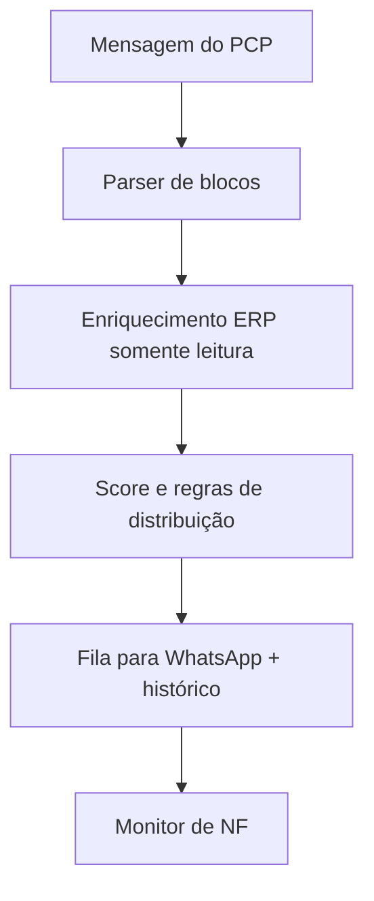

# AutoDistribuidor PCP

## Case público sanitizado

Automação de planejamento operacional que transforma uma lista de pedidos de venda (PVs) em filas de trabalho equilibradas, prontas para comunicação com a equipe.

A implementação real permanece em um repositório privado porque integra um ERP corporativo e rotinas internas. Este case mostra as decisões de produto e engenharia sem expor clientes, números de pedidos, endereços de rede, credenciais ou identificadores de planilhas.

## O problema

A entrada chega em texto livre, geralmente copiada de uma conversa do PCP. A distribuição manual precisava considerar, ao mesmo tempo:

- blocos de PVs que não podem ser separados;
- complexidade e quantidade de itens;
- continuidade do mesmo cliente no dia;
- carga já atribuída e alternância entre responsáveis;
- pedidos antigos, cancelados ou inexistentes;
- acompanhamento posterior da emissão de nota fiscal.

Contar apenas a quantidade de pedidos produzia uma divisão aparentemente equilibrada, mas operacionalmente injusta.

## Solução

O fluxo foi separado em componentes pequenos e testáveis:



O motor mantém estado diário local, registra ajustes manuais e permite reprocessar a mesma entrada sem perder o contexto da operação. Regras que mudam com o negócio ficam em configuração, não espalhadas pelo código.

## Decisões que importam

| Decisão | Por que existe |
| --- | --- |
| Preservar grupos de PVs | Evita separar volumes que precisam sair juntos |
| Pontuar complexidade | Aproxima a divisão do esforço real |
| Consultar o ERP sem escrever | Enriquece a decisão sem alterar o sistema oficial |
| Validar recência e status | Reduz erro de digitação e retrabalho |
| Persistir carga e histórico | Mantém continuidade entre rodadas e dias |
| Monitorar NF separadamente | Fecha o ciclo depois da distribuição |
| Configurar regras em YAML | Permite ajustar o processo sem refatorar o motor |

## Exemplo sintético

Entrada fictícia:

```text
[09:10] PCP: 50101 - Cliente Aurora
[09:11] PCP: 50102-50103 - Cliente Horizonte (mesmo volume)
[09:12] PCP: 50104 - Cliente Pátio
```

Saída ilustrativa:

```text
PEDRO
  50102-50103 · Cliente Horizonte · score 6

RHAYSSA
  50101 · Cliente Aurora · score 3
  50104 · Cliente Pátio · score 2
```

Os nomes, números e scores acima são fictícios e servem apenas para explicar a experiência.

## Arquitetura

- **Entrada:** parser tolerante a mensagens copiadas do WhatsApp.
- **Domínio:** score de complexidade, regras de cliente, carga diária e ajustes.
- **Integração:** consultas parametrizadas ao ERP; nenhuma operação de escrita é necessária para distribuir.
- **Interface:** desktop em CustomTkinter, com abas para distribuição, histórico, férias e monitor de NF.
- **Persistência:** JSON local para estado operacional; arquivos de exemplo não contêm dados de produção.
- **Qualidade:** testes automatizados para parser, pontuação, distribuição, roteamento, validação e monitoramento.

## Stack

Python · CustomTkinter · SQLAlchemy · SQL Server/ODBC · PyYAML · pytest

## O que este case demonstra

- transformar uma rotina informal em um motor de decisão auditável;
- modelar regras operacionais com prioridades e penalidades;
- integrar dados legados sem acoplar a interface ao banco;
- preservar segurança e privacidade ao documentar um sistema real;
- desenhar uma solução útil para quem opera, não apenas para quem desenvolve.

[Repositório do perfil](https://github.com/KaaioH013/KaaioH013) · [LinkedIn](https://www.linkedin.com/in/caio-santana-3443a3189/)

> Este documento é uma apresentação pública sanitizada. Não use os exemplos para inferir clientes, volumes ou resultados reais.
