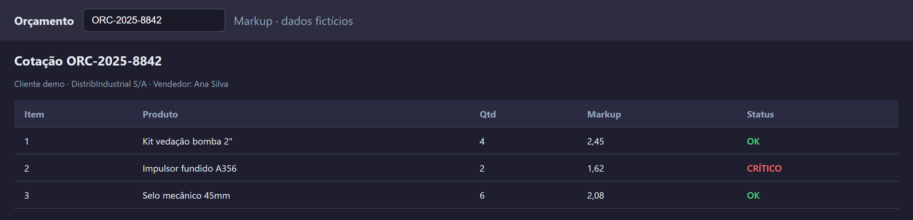
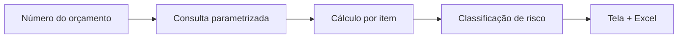

# Analisador de cotações

## Case público sanitizado

Aplicação desktop para consultar um orçamento, analisar markup por item e priorizar o que precisa de revisão comercial.

A implementação original integra um ERP corporativo e permanece privada. Esta apresentação usa uma interface de demonstração com orçamento, cliente, vendedor e produtos fictícios.

## O problema

A análise de uma cotação exigia abrir o ERP, localizar o orçamento, interpretar o preço de cada item e decidir rapidamente onde havia risco de margem. O processo era lento e dependia de consultas manuais.

## Solução

O aplicativo concentra a rotina em uma tela:

1. informar o número do orçamento;
2. consultar os dados em modo somente leitura;
3. calcular markup e indicadores da cotação;
4. classificar cada item por risco;
5. exportar o resultado para Excel.

*Captura com dados sintéticos. Não representa uma cotação real.*

## Regras de negócio

| Classificação | Interpretação |
| --- | --- |
| **OK** | markup dentro da faixa esperada |
| **ATENÇÃO** | item que merece validação comercial |
| **CRÍTICO** | margem abaixo do limite configurado |
| **PROBLEMA** | preço de venda igual ou inferior ao custo |

Os limites ficam em variáveis de ambiente para permitir ajuste sem alterar a interface.

## Arquitetura

- **Interface:** PySide6 com temas claro e escuro.
- **Dados:** SQL Server acessado por ODBC, sem operações de escrita.
- **Processamento:** pandas para consolidação e exportação.
- **Distribuição:** scripts de build para gerar executável Windows.
- **Configuração:** conexão e limites de markup via `.env`.

## Decisões técnicas

- manter a consulta restrita a um orçamento por vez para reduzir ambiguidade;
- separar acesso ao banco da camada de apresentação;
- usar queries parametrizadas;
- deixar as regras de classificação configuráveis;
- gerar uma planilha com resumo e detalhe para compartilhar a análise;
- manter uma demonstração independente do ERP para documentação pública.

## Stack

Python · PySide6 · pyodbc · SQL Server · pandas · openpyxl · PyInstaller

## O que este case demonstra

- tradução de uma rotina comercial em regras executáveis;
- leitura de dados legados com baixo acoplamento;
- construção de uma interface voltada à decisão, não apenas à consulta;
- preocupação com margem, priorização e distribuição do resultado;
- documentação pública sem expor clientes, pedidos, servidor ou credenciais.

[Voltar ao portfólio principal](https://github.com/KaaioH013/KaaioH013)

> Todos os dados exibidos nesta página são fictícios. A integração real exige ambiente autorizado e credenciais próprias.
