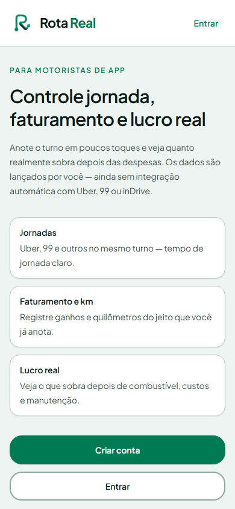
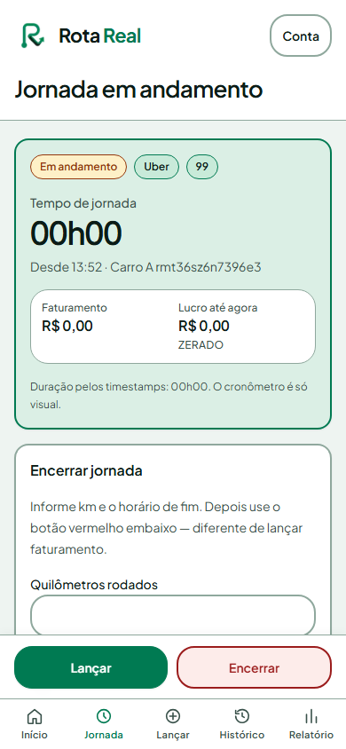
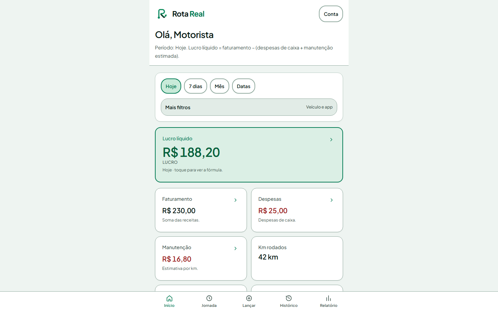
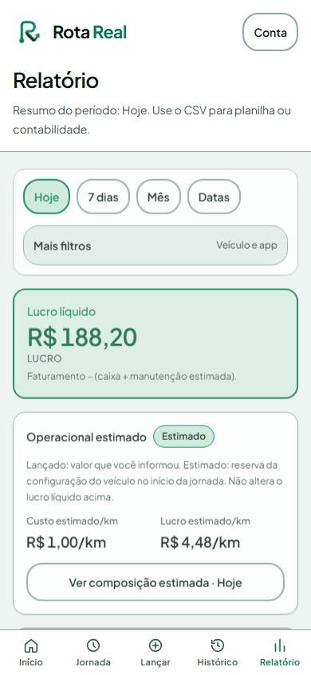

# Rota Real

PWA para motoristas acompanharem turnos, receitas e despesas de diferentes plataformas em um único lugar.

[**Abrir a aplicação online →**](https://rotareal.csaanalytics.com.br/)

## O problema

Quem trabalha com múltiplas plataformas precisa separar receitas, custos e períodos para saber se um turno realmente valeu a pena. O Rota Real organiza esse registro em um fluxo simples, pensado para uso no celular.

## O que o produto demonstra

- Cadastro e autenticação de usuários
- Registro de plataformas e veículo
- Início e encerramento de turnos
- Receitas e despesas associadas ao período
- Dashboard com filtros por dia, semana, mês e intervalo personalizado
- Histórico e relatório para acompanhamento financeiro
- Interface mobile-first com deploy em produção

## Stack

Next.js · React · TypeScript · Tailwind CSS · Supabase · Vercel

## Decisões técnicas

O fluxo foi modelado em torno de um turno aberto por usuário, permitindo registrar várias plataformas no mesmo período. As operações dependem de autenticação e políticas de acesso no banco. O endpoint de saúde verifica a conectividade da aplicação com o Supabase.

## Escopo e privacidade

Este repositório é uma vitrine pública. As imagens usam dados sintéticos e não contêm credenciais, e-mails ou informações de clientes. O código-fonte e a configuração do ambiente de produção permanecem em um repositório privado.

## Status

Aplicação online e funcional. O projeto continua recebendo ajustes de produto e documentação.
